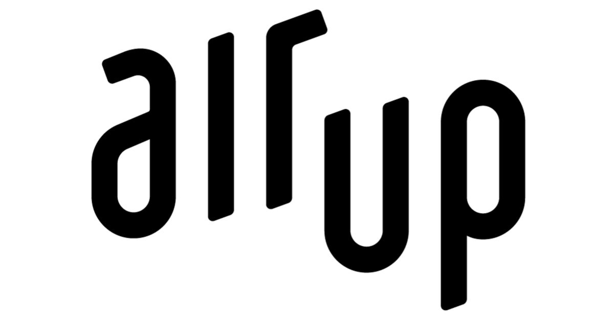
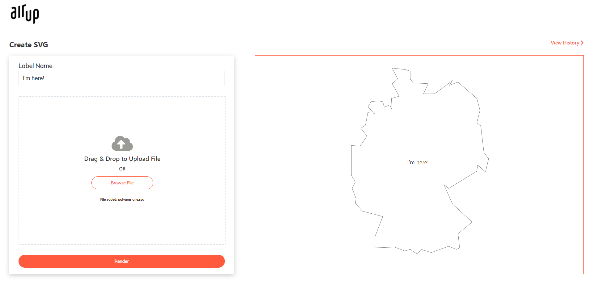

<!-- PROJECT LOGO -->
<br />
<p align="center">
    

  <h3 align="center">air up - SVG Label</h3>

  <p align="center">
    A simple application to place a label in the point of inaccessibility
    <br />
    ·
    <a href="https://github.com/MakeWaterGreatAgain/SeemranCaseStudy/issues">Report Bug</a>
    ·
    <a href="https://github.com/MakeWaterGreatAgain/SeemranCaseStudy/issues">Request Feature</a>
  </p>
</p>


<!-- TABLE OF CONTENTS -->
<details open="open">
  <summary>Table of Contents</summary>
  <ol>
    <li>
      <a href="#about-the-project">About The Project</a>
      <ul>
        <li><a href="#built-with">Built With</a></li>
      </ul>
    </li>
    <li>
      <a href="#getting-started">Getting Started</a>
      <ul>
        <li><a href="#prerequisites">Prerequisites</a></li>
        <li><a href="#installation">Installation</a></li>
      </ul>
    </li>
    <li><a href="#roadmap">Roadmap</a></li>
    <li><a href="#contact">Contact</a></li>
    <li><a href="#acknowledgements">Acknowledgements</a></li>
  </ol>
</details>


<!-- ABOUT THE PROJECT -->
## About The Project
<br />


SVG label is a small application to add label to the best point of inaccessibility 

* Add label to the svg polygon by
  * Enter label name
  * Browse or drop svg files to load the svg
  * Click the Render button to add label on the loaded svg
* You can view all rendered SVG by clicking on view history

### Built With


* [React JS](https://reactjs.org/)
* [Typescript](https://www.typescriptlang.org/)
* [Sass](https://sass-lang.com/)


<!-- GETTING STARTED -->
## Getting Started

To get a local copy up and running follow these simple steps.

### Prerequisites

Require Node to run this project
* npm
  ```sh
  npm install npm@latest -g
  ```

### Installation

1. Clone the repo
   ```sh
   git clone https://github.com/MakeWaterGreatAgain/SeemranCaseStudy.git
   ```
3. Install NPM packages
   ```sh
   npm install
   ```
4. Run API in `json server`
   ```JS
   json-server --watch db.json --port 3004
   ```
5. Excute the application
   ```JS
   npm run start
   ```


<!-- ROADMAP -->
## Roadmap

See the [open issues](https://github.com/MakeWaterGreatAgain/SeemranCaseStudy/issues) for a list of proposed features (and known issues).


<!-- CONTACT -->
## Contact

Seemran Xec - (simxec@gmail.com)

Project Link: [https://github.com/MakeWaterGreatAgain/SeemranCaseStudy.git](https://github.com/MakeWaterGreatAgain/SeemranCaseStudy.git)


<!-- ACKNOWLEDGEMENTS -->
## Acknowledgements
* [Typescript](https://www.typescriptlang.org/) : Used for error free code and faster developement
* [Sass](https://sass-lang.com/) : CSS pre-processor used for better structuring of the styles
* [Axios](https://axios-http.com/) : To make API request
* [React Router](https://reactrouter.com/web/guides/quick-start) : Used for routing of pages
* [TinyQueue](https://github.com/mourner/tinyqueue): Binary heap priority queue used in the alogorithm
* [Font Awesome](https://fontawesome.com/): Icon library
* [JSON Server](https://fontawesome.com/): Dummy server to mimic API

</br>

#### References used for this project
   * https://sites.google.com/site/polesofinaccessibility/
